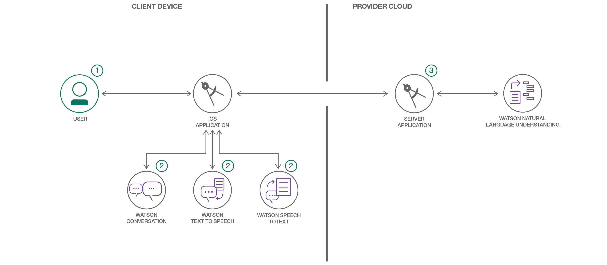

# CognitiveConcierge

> Watson Conversation is now Watson Assistant. Although some images in this code pattern may show the service as Watson Conversation, the steps and processes will still work.

CognitiveConcierge is an end-to-end Swift application sample with an iOS front end and a Kitura web framework back end. This application also demonstrates how to pull in a number of different Watson services to your Swift client and server side apps via the Watson Developer Cloud's [Swift SDK](https://github.com/watson-developer-cloud/swift-sdk), including Watson Assistant, Text to Speech, Speech to Text, and the Natural Language Understanding service.


## Included Components
- Watson Assistant service
- Watson Text to Speech service
- Watson Speech to Text service
- Watson Natural Language Understanding service
- Google Places API

## Application Workflow Diagram


1. The user deploys the server application to IBM Cloud.

2. The user interacts with the IOS application.

3. When the user performs any action, IOS application the server application API which uses the Watson services and Google Places API to provide the user recommendations.

## Prerequisite
* **Obtain a Google Places API Key for Web:** For this project, you'll need an API Key from Google Places, so that app can have access to review text which will be sent to the Natural Language Understanding service for analysis.  Instructions for obtaining a key can be found [here](https://developers.google.com/places/web-service/get-api-key).
Once you have an API Key, go to the [Google Developer's Console](https://console.developers.google.com/flows/enableapi?apiid=places_backend&reusekey=true), create a project, add your API key and enable the Google Places API for iOS as well.  Make note of the API key for later use in your server and iOS applications.

If you haven't so yet, you also need to download and install the following:
* [Carthage Dependency Manager](https://github.com/Carthage/Carthage/releases)
* [CocoaPods](https://cocoapods.org/?q=cvxv)

## Steps
Use the following steps to deploy the application
- Deploy the Server Application
- Update the Watson Assistant Service on IBM Cloud
- Run the IOS Application

## 1. Deploy the Server Application

You can deploy the server application using any one of the following ways:
- Deploy to Bluemix button
- Bluemix command line

### a) Using the Deploy to Bluemix button
Clicking on the button below creates a IBM Cloud DevOps Toolchain and deploys this application to the IBM Cloud. The `manifest.yml` file [included in the repo] is parsed to obtain the name of the application, configuration details, and the list of services that should be provisioned. For further details on the structure of the `manifest.yml` file, see the [Cloud Foundry documentation](https://docs.cloudfoundry.org/devguide/deploy-apps/manifest.html#minimal-manifest).

[](https://bluemix.net/deploy?repository=https://github.com/IBM/CognitiveConcierge.git)

Once deployment to the IBM Cloud is completed, you can view the deployed application and services from your IBM Cloud account.

### b) Using the Bluemix command line

You can also manually deploy the Server Application to the IBM Cloud. Though not as magical as using the Bluemix button above, manually deploying the app gives you some insights about what is happening behind the scenes. Remember that you'd need the Bluemix [command line](http://clis.ng.bluemix.net/ui/home.html) installed on your system to deploy the app to the IBM Cloud.

Execute the following command to clone the Git repository:

```bash
git clone https://github.com/IBM/CognitiveConcierge.git
```

Go to the project's root folder on your system and execute the `Cloud-Scripts/services/services.sh` script to create the services CognitiveConcierge depends on. Please note that you should have logged on to the IBM Cloud before attempting to execute this script. For information on how to log in, see the IBM Cloud [documentation](https://console.ng.bluemix.net/docs/starters/install_cli.html).

Executing the `Cloud-Scripts/services/services.sh` script:
```bash
$ ./Cloud-Scripts/services/services.sh
```

Before deploying your application to the cloud, you will need to update it with the google API Key.  In the main.swift folder, update the struct value with your google API Key.

After the services are created and you've updated this file, you can issue the `bx app push YOUR_APP_NAME` command from the project's root folder `CognitiveConcierge` to deploy the server application to IBM Cloud.

Once the application is running on the IBM Cloud, you can access your application's assigned URL (i.e. route). To find the route, you can log on to your [IBM Cloud account](https://console.ng.bluemix.net), or you can inspect the output from the execution of the `bluemix app push` or `bx app show <application name>` commands. The string value shown next to the `urls` field contains the assigned route.  Use that route as the URL to access the sample server using the browser of your choice.

```bash
$ bx app show CognitiveConcierge
Invoking 'cf app CognitiveConcierge'...

Showing health and status for app CognitiveConcierge in org ishan.gulhane@ibm.com / space dev as ishan.gulhane@ibm.com...
OK

requested state: started
instances: 1/1
usage: 512M x 1 instances
urls: cognitiveconcierge-lazarlike-archaizer.mybluemix.net
last uploaded: Mon Jun 5 18:01:42 UTC 2017
stack: cflinuxfs2
buildpack: swift_buildpack

     state     since                    cpu    memory         disk           details
#0   running   2017-06-05 11:05:41 AM   0.3%   6.4M of 512M   269.8M of 1G
```

## 2. Update Assistant Service
- The Watson Assistant service enables you to add a natural language interface to your applications.  The Watson Assistant service requires some initial workspace configuration.  Go to the IBM Cloud dashboard and launch the Watson Assistant service.  It should be named something like CognitiveConcierge-Assistant.  Manually populate the workspace by clicking the upload button, and then upload the JSON found in `Resources/conversationWorkspace.json`. Make note of the workspace id for later use in running the iOS application.

## 3. Run the iOS Application

### Install the necessary dependencies
- From Terminal, change directories into the `YourProjectName/CognitiveConcierge-iOS` folder and run the following command to install the necessary dependencies (This may take some time):
```bash
carthage update --platform iOS
pod install
```

### Update configuration for iOS app
- Open the `CognitiveConcierge.xcworkspace` file in Xcode 9.2 from your terminal using `open CognitiveConcierge.xcworkspace`

- **Update CognitiveConcierge.plist file:** One way to persist data in Swift is through the property list or .plist file. You will need to open this file and add the credentials for all of the services that were created for you earlier, as well as the Google Places API Key mentioned in the Prerequisites section.  You can find these services in the Bluemix dashboard.  Click the service name you're interested in, and then click `Service Credentials`.  If there is no Credential created, click `New Credential`. If your Assistant service uses an API Key, remove the ConversationUsername and ConversationPassword keys from the file; if not, remove the ConversationIamApiKey key.

- **Update bluemix.plist file:**
	- You should set the `isLocal` value to `YES` if you'd like to use a locally running server; if you set the value to `NO`, then you will be accessing the server instance running on the IBM Cloud.
	- To get the `appRouteRemote` value, you should go to your application's page on the IBM Cloud. There, you will find a `View App` button near the top right. Clicking on it should open up your app in a new tab, the url for this page is your route which maps to the appRouteRemote key in the plist. Make sure to include the `http:// protocol` in your `appRouteRemote` and to exclude a forward slash at the end of the url.
	- You can also use the command `bx app env CognitiveConcierge` where appRouteRemote is uris.
	```bash
	{
	 "VCAP_APPLICATION": {
	  "application_id": "3d06c0e7-1fff-4dbf-b0cb-b289770eccfe",
	  "application_name": "CognitiveConcierge",
	  "application_uris": [
	   "cognitiveconcierge-lazarlike-archaizer.mybluemix.net"
	  ],
	  "application_version": "3ef63168-35f5-4517-84e9-e8f19c8f34b4",
	  "limits": {
	   "disk": 1024,
	   "fds": 16384,
	   "mem": 512
	  },
	  "name": "CognitiveConcierge",
	  "space_id": "2b3083b9-7ef9-4d55-9741-34433be4cea1",
	  "space_name": "dev",
	  "uris": [
	   "cognitiveconcierge-lazarlike-archaizer.mybluemix.net"
	  ],
	  "users": null,
	  "version": "3ef63168-35f5-4517-84e9-e8f19c8f34b4"
	 }
	}

	Running Environment Variable Groups:
	BLUEMIX_REGION: ibm:yp:us-south

	Staging Environment Variable Groups:
	BLUEMIX_REGION: ibm:yp:us-south
	```

### Running the application
Press the `Play` button in Xcode to build and run the project in the simulator or on your iPhone!


## Running the Kitura-based server locally
Before building the CognitiveConcierge-Server application, first update the credentials in the config/nlu-creds file for local development.

You can then build the CognitiveConcierge-Server by going to the `CognitiveConcierge-Server` directory of the cloned repository and running `swift build`. To start the Kitura-based server for the CognitiveConcierge app on your local system, go to the `CognitiveConcierge-Server` directory of the cloned repository and run `.build/debug/CognitiveConcierge`. You should also update the `bluemix.plist` and `CognitiveConcierge.plist` file in the Xcode project in order to have the iOS app connect to this local server. See the [Update configuration for iOS app](#update-configuration-for-ios-app) section for details.

## CognitiveConcierge App video

[](http://vimeo.com/222564546 "Cognitive Concierge Overview")

## Learn More About
* https://www.ibm.com/cloud/garage/content/architecture/cognitiveConversationDomain/
* https://github.com/IBM-Swift/swift-buildpack
* https://developer.ibm.com/swift/
* https://swift.sandbox.bluemix.net/#/repl?cm_sp=dw-bluemix-_-code-_-devcenter

## Troubleshooting
- If the deployment for server application stage fails, redeploy the pipeline stage.
- If the IOS application is not able to connect to Watson Services, recheck the credential values in `CognitiveConcierge.plist` and `bluemix.plist` files.

## License
[Apache 2.0](LICENSE)
