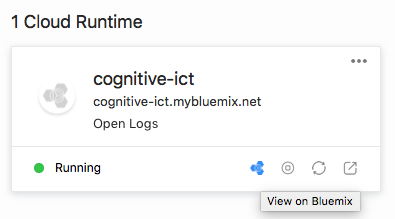
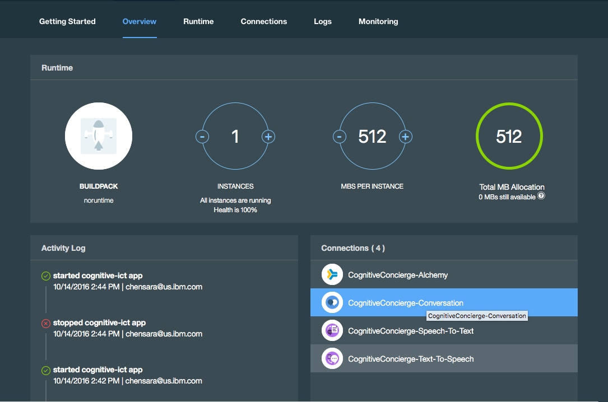
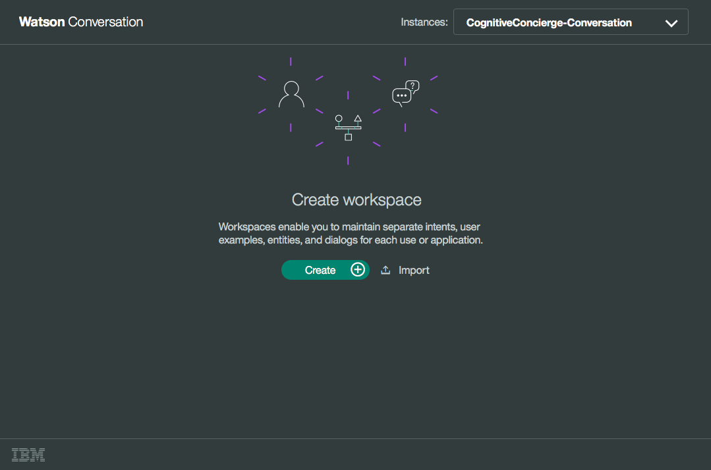
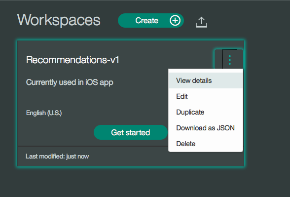
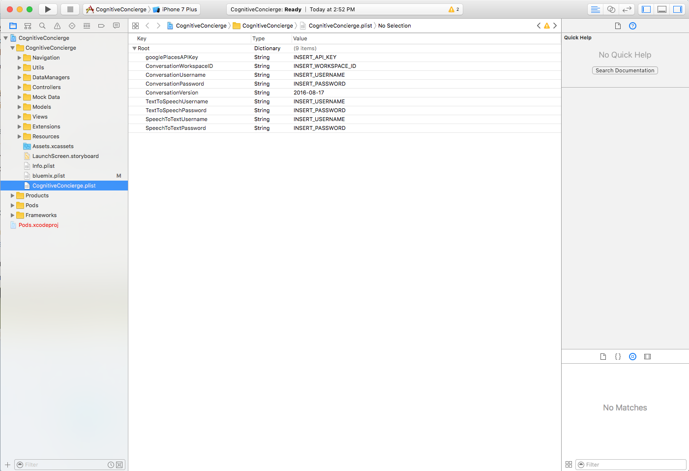
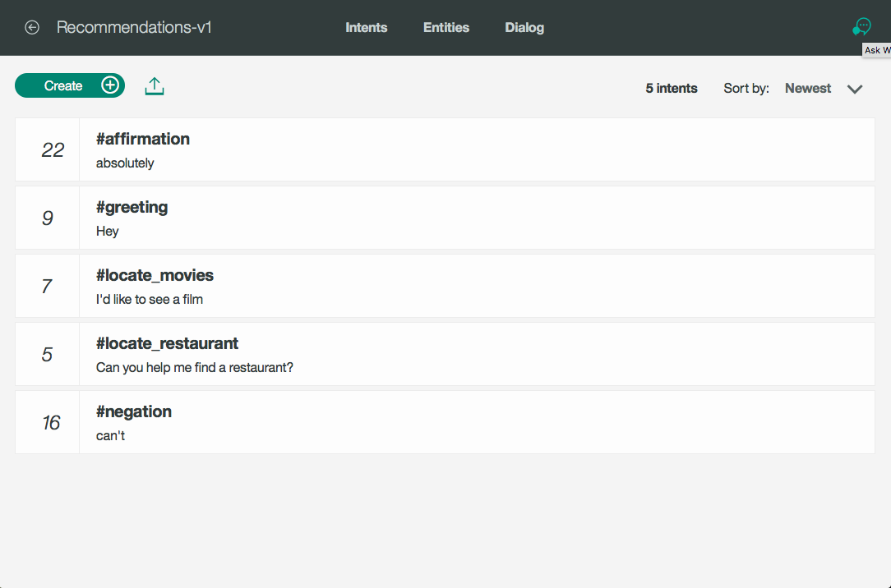
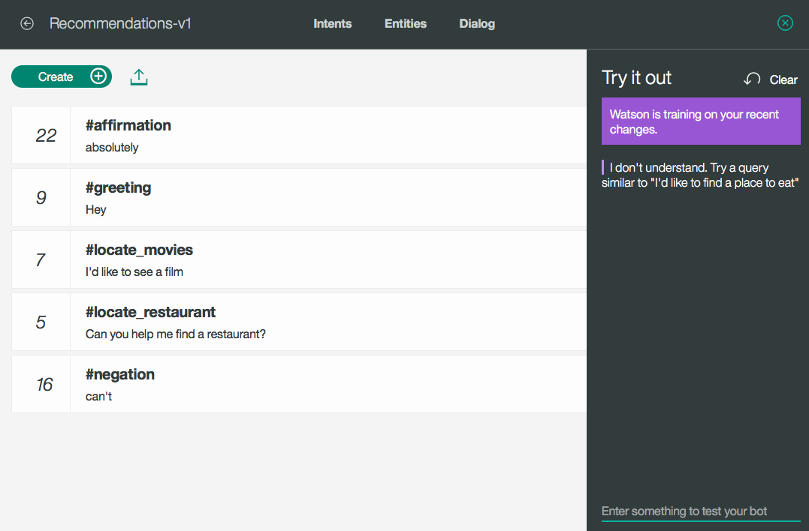
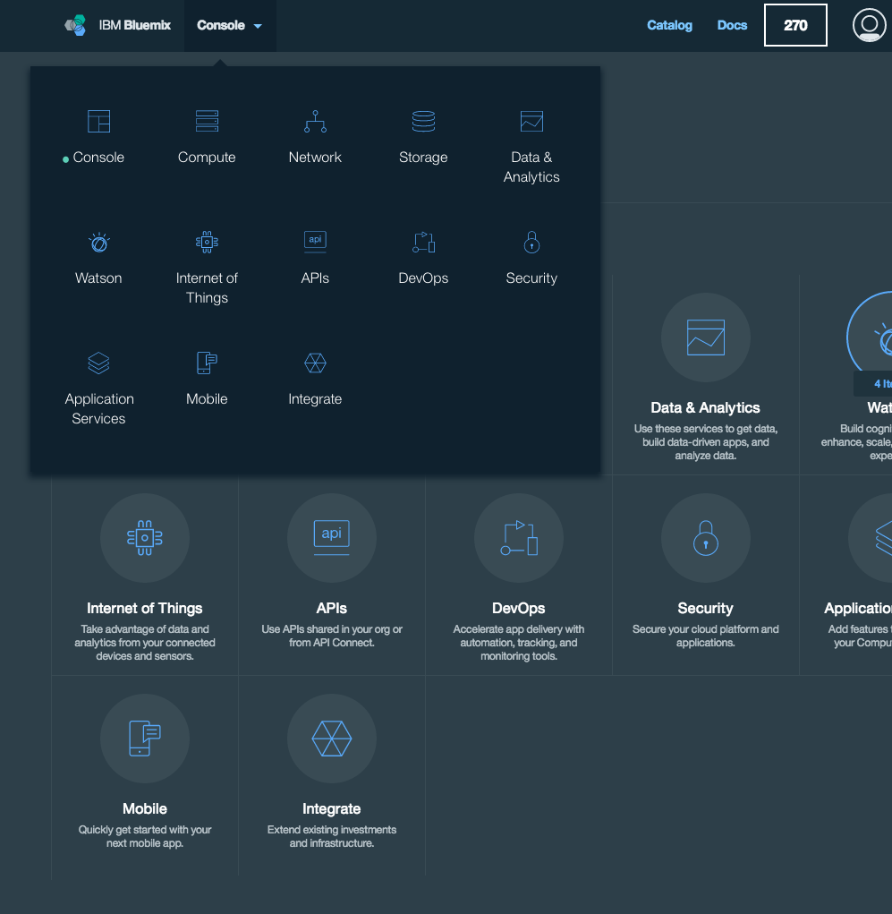
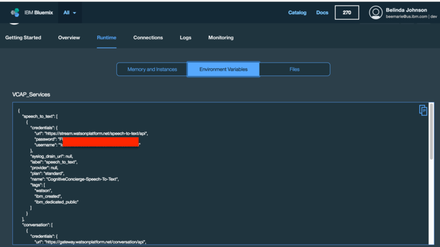

[](https://www.apache.org/licenses/LICENSE-2.0)


# CognitiveConcierge
CognitiveConcierge is an end-to-end Swift application sample with an iOS front end and a Kitura web framework back end. This application also demonstrates how to pull in a number of different Watson services to your Swift client and server side apps via the Watson Developer Cloud's iOS SDKs, including Conversation, Text to Speech, Speech to Text, and the Alchemy Language APIs.


## IBM Cloud Tools for Swift (ICT) Instructions
### Obtain a Google Places API Key for Web
1. For this project, you'll need an API Key from Google Places, so that app can have access to review text which will be sent to the Alchemy API service for analysis.  Instructions for obtaining a key can be found [here](https://developers.google.com/places/web-service/get-api-key).
2. Once you have an API Key, go to the Google Developer's Console, and enable the Google Places API for iOS as well.  Make note of the API key for later use in your server and iOS applications.

### Deploy the Server Application to Bluemix using ICT.
1. Install [IBM Cloud Tools for Swift] (http://cloudtools.bluemix.net/) for MacOS.
2. Once you've installed the application, you can open it to get started.
3. Click the Create (+) button to set up a new project, and then select the Cognitive Concierge Application.
5. Click Save Files to Local Computer to clone the project.
6. Once the project is cloned, open up the .xcodeproj file that was created for you in ICT under Local Server Repository. Edit the Sources/restaurant-recommendations/Configuration.swift file's Constants struct with your own Google API Key for Web.

	

7. Finally, you can use ICT to deploy the server on Bluemix.  Click Provision and Deploy Sample Server on Bluemix under Cloud Runtimes.

	

8. Give your Cloud Runtime a unique name, and click Next.  This deployment to Bluemix may take a few minutes.

### Point iOS Application to Server Application
1. In ICT, ensure that the Connected to: field in the Client application is pointed to your server instance running on Bluemix.  You can also point to your localhost for local testing, but you need to be running a local instance of the server application for this to work.

### Update Conversation Service
1. Once ICT has provisioned your Cloud Runtime, you should have a Conversation Service instance in your Bluemix dashboard.  This Service enables you to add a natural language interface to your applications.  While you could create a conversation tree manually, we've provided the conversation for this application in the Resources folder at the top level of the project.
2. In ICT, Click on the Bluemix icon in Cloud Runtime to go to your 'Application Details' page on Bluemix.

	

3. Select the CognitiveConcierge-Conversation Service under Connections.

	

4. Scroll down and select 'Launch Tool'.
5. Log into Watson Conversation with your IBM ID and you will be brought to the 'Create Workspace' page. Select Import, and upload your .JSON file (Resources/conversationWorkspace.json) representing the conversation for this application.

	

6. Once the Conversation is created, select the More Options icon, and click View Details.  Note the Workspace ID for use in your iOS application.

	

7. Open the CognitiveConcierge.xcworkspace file from ICT. Copy the WorkspaceID into the CognitiveConcierge.plist file.

	

8. Note: Watson may take a few minutes to train based on the conversation workspace you uploaded.  Check if Watson is finished training by clicking the conversation workspace, then Dialog, and then the chat icon in the upper right hand corner.  

	

    This is also how you can try out the conversation and test your bot.
	
	

### Run the iOS Application
1. Install Cocoapods Dependency Manager in Terminal with the command `sudo gem install cocoapods`

2. Install Carthage Dependency Manager.  Either download and run the .pkg file for their latest release https://github.com/Carthage/Carthage/releases or simply run `brew update` followed by `brew install carthage`
3. From Terminal, change directories into the YourProjectName/CognitiveConcierge-iOS folder.
4. Run the following commands to install the necessary dependencies:
  ```
  carthage update --platform iOS
  
  pod install
  ```
5. Open the CognitiveConcierge.xcworkspace file in Xcode 8 either from ICT or from your terminal using `open CognitiveConcierge.xcworkspace`
6. Enter your credentials for each service required to run the app into the same CognitiveConcierge.plist file you entered the Conversation Service's Workspace ID: `CognitiveConcierge-iOS/CognitiveConcierge/CognitiveConcierge.plist`. Find each credential by returning to your application details page which you can access by clicking on the Bluemix icon within ICT's Cloud Runtime or following these steps:
    1. Go to [Bluemix](https://new-console.ng.bluemix.net/#overview) and make sure you're on the 'Console' screen:

        

    2. Select 'All Items' on the Console Screen and click on the name of your application listed under Cloud Foundry Applications. The route/URL provided next to the name will only take you to page hosted by your app; not the page we're looking for. This should bring you to the Bluemix page you saw previously in finding the Conversation service.

7. Click on 'Runtime' then 'Environment Variables' to access every services' credentials within VCAP_Services to add into the `CognitiveConcierge.plist` file.

      

8. Press the Play button in Xcode to build and run the project in the simulator or on your iPhone!

## Privacy Notice
This Swift application includes code to track deployments to [IBM Bluemix](https://www.bluemix.net/) and other Cloud Foundry platforms. The following information is sent to a [Deployment Tracker](https://github.com/IBM-Bluemix/cf-deployment-tracker-service) service on each deployment:

* Swift project code version (if provided)
* Swift project repository URL
* Application Name (`application_name`)
* Space ID (`space_id`)
* Application Version (`application_version`)
* Application URIs (`application_uris`)
* Labels of bound services
* Number of instances for each bound service and associated plan information

This data is collected from the parameters of the `CloudFoundryDeploymentTracker`, the `VCAP_APPLICATION` and `VCAP_SERVICES` environment variables in IBM Bluemix and other Cloud Foundry platforms. This data is used by IBM to track metrics around deployments of sample applications to IBM Bluemix to measure the usefulness of our examples, so that we can continuously improve the content we offer to you. Only deployments of sample applications that include code to ping the Deployment Tracker service will be tracked.

### Disabling Deployment Tracking
Deployment tracking can be disabled by removing the following line from main.swift:
```
CloudFoundryDeploymentTracker(repositoryURL: "https://github.ibm.com/MIL/CognitiveConcierge", codeVersion: nil).track()

```
